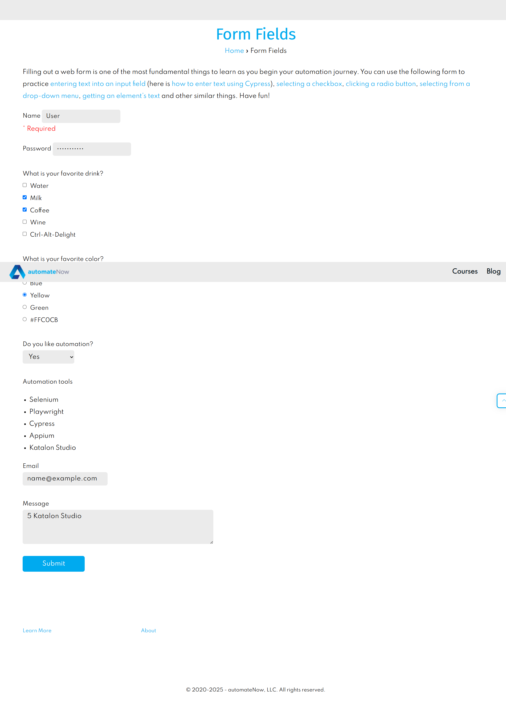
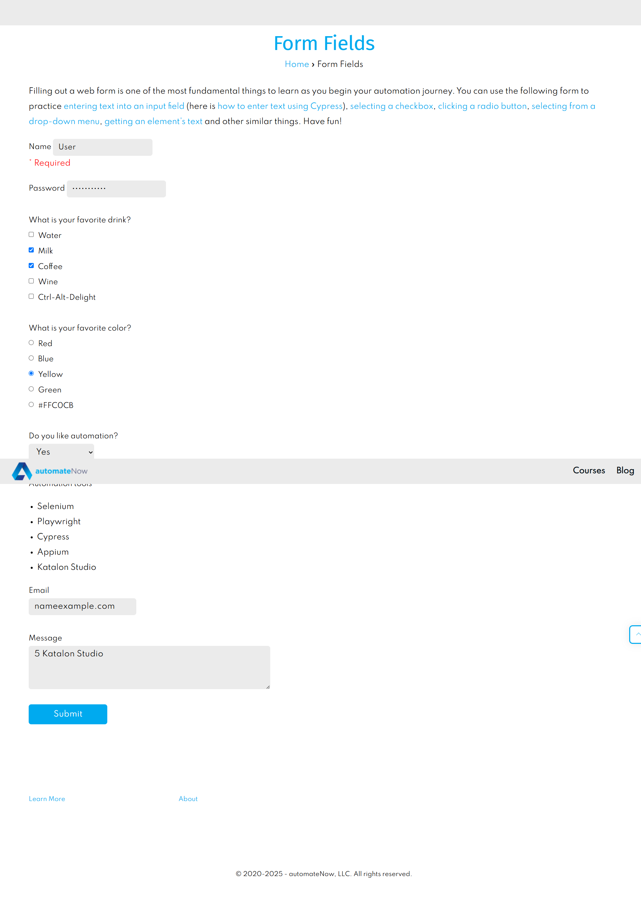
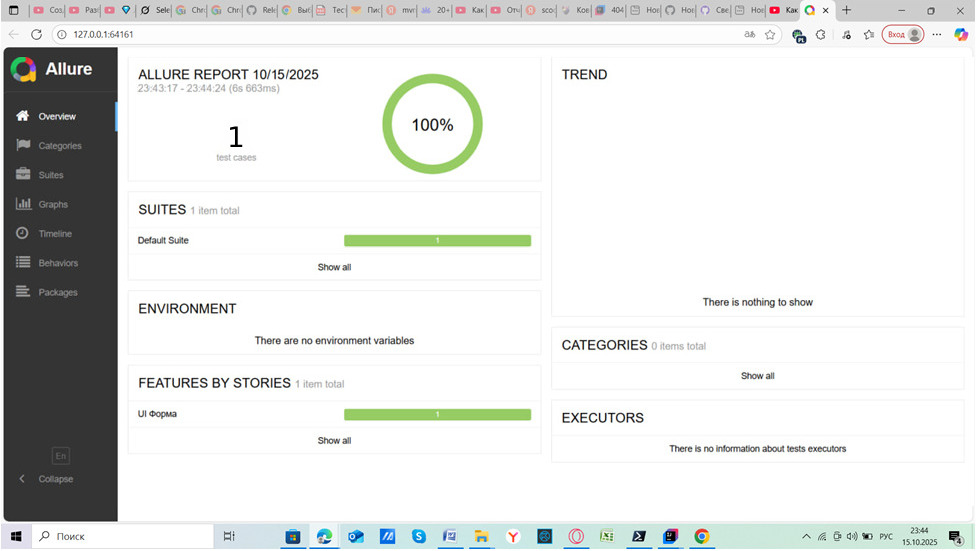

# Тестовое задание
 
## Позитивный тест-кейс
1.	Заполнить поле Name значением "User".
2.	Заполнить поле Password значением "password123".
3.	Из списка What is your favorite drink? выбрать Milk и Coffee.
4.	Из списка What is your favorite color? выбрать Yellow.
5.	В поле Do you like automation? выбрать "Yes".
6.	Поле Email заполнить строкой "name@example.com".
7.	В поле Message написать "5 Katalon Studio".
8.	Нажать на кнопку Submit. Expected Result: Появляется алерт с текстом "Message received!".

   
   
## Негативный тест-кейс

1.	Заполнить поле Name значением "User".
2.	Заполнить поле Password значением "password123".
3.	Из списка What is your favorite drink? выбрать Milk и Coffee.
4.	Из списка What is your favorite color? выбрать Yellow.
5.	В поле Do you like automation? выбрать "Yes".
6.	Поле Email заполнить строкой "nameexample.com".
7.	В поле Message написать "5 Katalon Studio".
8.	Нажать на кнопку Submit. Expected Result: Появляется алерт с текстом "The message was not received".

## P.S.
Cформировать отчеты о пройденном тесте

